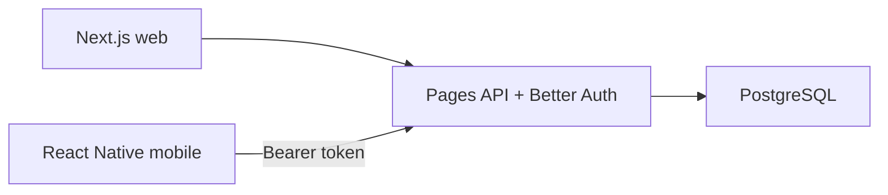

# Doktersdienst — developer onboarding

High-level orientation for new contributors. For setup details, domain rules, and feature specs, follow the links at the end.

## What is Doktersdienst?

Doktersdienst is a Dutch web app for GP out-of-hours / on-call scheduling within **waarneemgroepen** (on-call groups). Doctors plan preferences, view and build roosters, and hand off shifts (**overnames**).

The app is a migration from a legacy PHP system. Existing data and the `diensten` type system must stay compatible — treat legacy behaviour as a constraint, not something to “clean up” casually.

## Two product areas

| Area | What it covers | Routes |
|------|----------------|--------|
| **Doktersdienst** | Roosters, voorkeuren, overnames, urentelling, locaties, group/member admin | Top-level pages (`/rooster-inzien`, `/voorkeuren`, `/overnames`, …) |
| **Praktijkplanner** | Practice activities, absences, capacity / dayparts | `/praktijkplanner/*` |

## Architecture

The web app uses session cookies. The React Native mobile client authenticates against the same API with Better Auth **bearer** tokens.

## Core domain concepts

| Concept | Meaning |
|---------|---------|
| **Waarneemgroep** | An on-call group: the unit for membership, roles, and most scheduling |
| **Deelnemer** | A member (doctor/user); auth is tied to deelnemers |
| **Dienst** | A row in `diensten` — the central model for slots, assignments, preferences, and overnames (discriminated by `type` / `status`) |
| **Three-stripe shift block** | UI for a time slot: **achterwacht** (top) / **standaard** (middle) / **extra** (bottom) |
| **Overname** | Shift takeover propose / accept / decline, encoded as special `diensten` types with status |

Full type rules: [DIENST_TYPES.md](../DIENST_TYPES.md) and the [constitution](../.specify/memory/constitution.md).

## Roles

Effective access often depends on the selected waarneemgroep membership.

| Tier (`idgroep`) | Role | Typical access |
|------------------|------|----------------|
| 1 | Deelnemer | Own rooster, voorkeuren, overnames |
| 2 | Secretaris | Group roster editing, members, group settings |
| 5 | Administrator | System-wide admin (shifts, regions, vacations, …) |

See [`src/lib/roles.ts`](../src/lib/roles.ts) and [`src/lib/route-access.ts`](../src/lib/route-access.ts).

## Tech stack

| Layer | Choice |
|-------|--------|
| App | Next.js 16 (Pages Router), React 19, TypeScript |
| Auth | Better Auth |
| DB | PostgreSQL + Drizzle ORM |
| UI | Tailwind CSS 4, Base UI / shadcn-style components |
| Tests | Vitest, Playwright |
| Email | React Email + Resend |
| Infra | Docker, Pulumi under `infra/` |

## Repo map

| Area | Path |
|------|------|
| Pages / routes | `src/pages/` |
| API routes | `src/pages/api/` |
| UI components | `src/components/` |
| Auth, roles, access | `src/lib/auth.ts`, `roles.ts`, `route-access.ts` |
| DB schema | `drizzle/schema.ts` |
| Feature specs | `specs/` |
| Infra | `infra/` |

## Getting started

1. `npm install`
2. Configure the database — [DATABASE_SETUP.md](../DATABASE_SETUP.md)
3. Configure auth — [BETTER_AUTH_SETUP.md](../BETTER_AUTH_SETUP.md)
4. `npm run dev` — app on **http://localhost:3005**
5. `npm test` and `npm run lint` before pushing

## Mobile

A sibling React Native app (`doktersdienst-mob`) uses the same backend APIs with Better Auth bearer tokens. This repo’s docs do not cover the mobile codebase.

## Further reading

- [Constitution](../.specify/memory/constitution.md) — core principles and diensten integrity
- [DIENST_TYPES.md](../DIENST_TYPES.md) — `diensten.type` reference
- [DATABASE_SETUP.md](../DATABASE_SETUP.md) / [BETTER_AUTH_SETUP.md](../BETTER_AUTH_SETUP.md)
- Specs: [001 fix-shift-assignment](../specs/001-fix-shift-assignment/), [002 overname-feature](../specs/002-overname-feature/)
